# Configuration Guide

1. [DefineConfig and Bootstrap](#defineconfig-and-bootstrap)
2. [Presets](#presets)
   - [base](#base)
   - [slide](#slide)
     - [Standalone Page](#standalone-page)
     - [Inside base.preset](#inside-basepreset)
     - Parameters
       - [Title](#title-required)
       - [Button](#button-required)
       - [Description](#description-optional)
       - [Media](#media-optional)
       - [List](#list-optional)
       - [Pagination](#pagination-optional)
       - [TextAlign](#textalign-optional)
       - [Shape](#shape-optional)
       - [Background](#background-optional)
   - [form](#form)
     - Parameters
       - [Form](#form)
   - [paywall](#paywall)
     - Parameters
       - [products](#products-required)
       - [links](#links-required)
       - [mainButtonText](#mainbuttontext-optional)
       - [popup](#popup-optional)
         - [Type](#type)
         - [Title](#title)
         - [Message](#message)
         - [Buttons](#buttons)
   - [paywall_single](#paywall_single)
     - Parameters
       - [product](#product-required)
   - [paywall_row](#paywall_row)
     - Parameters
       - [products](#products-required-1)
3. [Media](#media)
   - [Image](#image)
   - [Sticker](#sticker)
   - [Video](#video)
   - [Icon](#icon)
   - [Emodji](#emodji)
4. [Button Actions](#button-actions)
5. [Theme](#theme)
6. [Currency Config](#currency-config)
7. [Localization](#localization)
8. [Currency localization](#currency-localization)
9. [Custom Presets](#custom-presets)

# DefineConfig and Bootstrap

You can check their area of responsibility [here](./packages/generation/README.md)

The structure of your configuration:

```ts
export default defineConfig({
    // [Required]. App pages configuration.
    // More info in the "Presets" section
    pages: [...],

    // [Optional]. Theme configuration.
    // More information in the "Theme" section
    theme: '',

    // [Optional]. Localization configuration.
    // More information in the "Localization" section
    locale: {},

    // [Optional]. Currency configuration.
    // More information in the "Currency Config" section
    currencyConfig: {},

    // [Optional]. custom presets configuration
    // More info in the "Custom Presets" section
    definePresets: {},
});
```

# Presets

In the `pages` section of your configuration file, you can extend our presets with the following code:

```ts
export default defineConfig({
  pages: [
    {
      extends: 'base',
    },
    {
      extends: 'slide',
    },
    {
      extends: 'form',
    },
    // ...
  ],
});
```

You can see all available extensions in the examples below

## base

```json
{
  "extends": "base",
  "slides": []
}
```

[Link to the component](./packages/generation/presets/base/README.md)

This is the main preset of your application, representing a [Carousel](./packages/ui/components/Carousel/README.md). You can use it without defining an extends keyword. We will automatically resolve this preset **only for root elements** inside the pages section

```ts
export default defineConfig({
  pages: [
    {
      // optional
      // extends: 'base',
      slides: [],
    },
  ],
});
```

The only required parameter for this `base.preset` is `slides`, which takes an array of other presets.

```ts
export default defineConfig({
  pages: [
    {
      slides: [
        {
          extends: 'slide',
          // ...
        },
        {
          extends: 'from',
          // ...
        },
        // ...
      ],
    },
  ],
});
```

By default, if there is no `extends` keyword inside the `slides`, the `Base` will use [slide preset](#slide)

So, this is valid config for this case:

```ts
export default defineConfig({
  pages: [
    {
      slides: [
        {
          title: 'Title',
          // ...
        },
        // ...
      ],
    },
  ],
});
```

## slide

```json
{
  "extends": "slide"
}
```

[Link to the component](./packages/generation/presets/slide/README.md)

This preset can be used as a standalone page or inside [base.preset](#base)

### Standalone page

```ts
export default defineConfig({
  pages: [
    {
      // it's important to use a extends: 'slide' here for a standalone page
      extends: 'slide',
    },
  ],
});
```

### Inside base.preset

Refer to the examples above for [base.preset](#base)

### Parameters

The examples below are for standalone page usage. The same configuration can be used for a slide inside [base.preset](#base).

And `Button` will be shown only inside Telegram

> [!IMPORTANT]
> All text parameters support HTML inside strings. For example:
>
> ```
> title: 'Hello <b>World!</b>'
> ```
>
> Please ensure that you are writing safe HTML.

#### Title [Required]

```ts
export default defineConfig({
  pages: [
    {
      extends: 'slide',
      title: 'Title',
    },
  ],
});
```

<details>
  <summary>With the code above you will get this result:</summary>

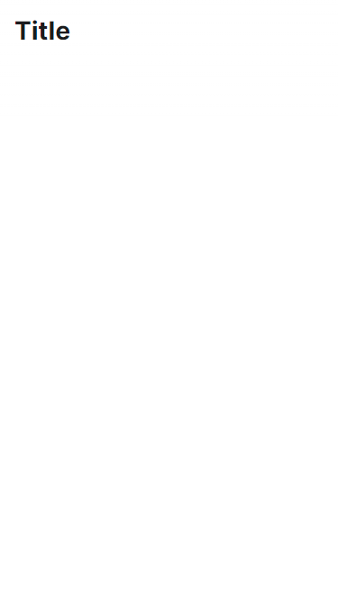

</details>

#### Button [Required]

You can configurate some actions by clicking on the MainButton with this parameter. [More about this see here](#button-actions)

```ts
export default defineConfig({
  pages: [
    {
      extends: 'slide',
      title: 'Title',
      button: 'Button',
    },
  ],
});
```

<details>
  <summary>With the code above you will get this result:</summary>

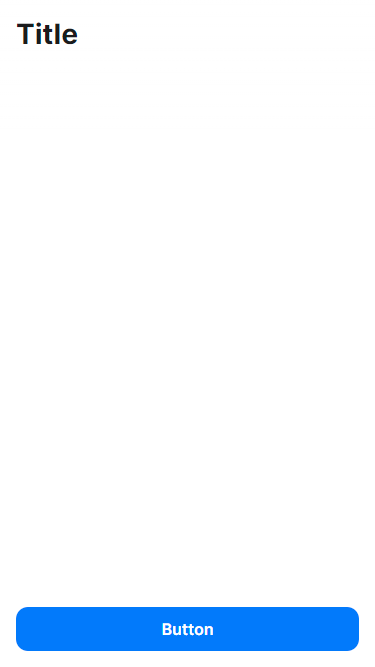

</details>

### Description [Optional]

```ts
export default defineConfig({
  pages: [
    {
      extends: 'slide',
      title: 'Title',
      description: 'Description',
      button: 'Button',
    },
  ],
});
```

<details>
  <summary>With the code above you will get this result:</summary>


</details>

### Media [Optional]

All available media parameters see [here](#media)

```ts
export default defineConfig({
  pages: [
    {
      extends: 'slide',
      media: {
        type: 'image',
        // you can use here src as webp, png, jpg and so on
        src: import('./assets/img/base.webp'),
      },
      title: 'Title',
      description: 'Description',
      button: 'Button',
    },
  ],
});
```

<details>
  <summary>With the code above you will get this result:</summary>

Keep in mind that all media presets with `type="image"` by default will be with aspect-ratio: 1/1

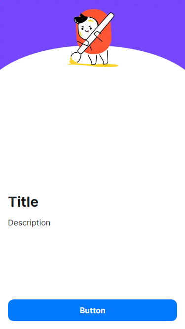

</details>

### List [Optional]

You can write list as array of string. We will add default icon for them

```ts
export default defineConfig({
  pages: [
    {
      extends: 'slide',
      title: 'Title',
      description: 'Description',
      list: ['Item 1', 'Item 2', 'Item 3'],
      button: 'Button',
    },
  ],
});
```

<details>
  <summary>With the code above you will get this result:</summary>

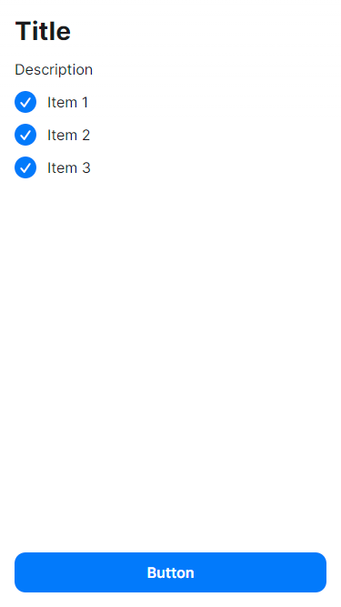

</details>

Our you can write list as array of objects with parameters:

```ts
{
  // media is optional. All available media parameters see media section of this page
  media?: {},
  text: 'string',
}
```

```ts
export default defineConfig({
  pages: [
    {
      extends: 'slide',
      title: 'Title',
      description: 'Description',
      list: [
        {
          text: 'item 1',
        },
        {
          media: {
            type: 'icon',
            src: import('./assets/icons/star.svg'),
          },
          text: 'item 2',
        },
      ],
      button: 'Button',
    },
  ],
});
```

<details>
  <summary>With the code above you will get this result:</summary>

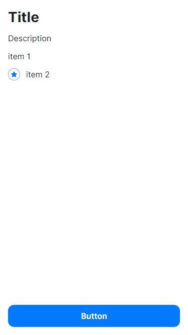

</details>

### Pagination [Optional]

If you are using the [slide.preset](#slide) inside slides in [base.preset](#base), you can use the `pagination` parameter to show the counter on the page. If it's not inside [base.preset](#base), pagination won't be displayed.

```ts
export default defineConfig({
  pages: [
    {
      slides: [
        {
          extends: 'slide',
          title: 'Title',
          description: 'Description',
          pagination: 'count',
          list: ['Item 1', 'Item 2', 'Item 3'],
          button: 'Button',
        },
      ],
    },
  ],
});
```

<details>
  <summary>With the code above you will get this result:</summary>

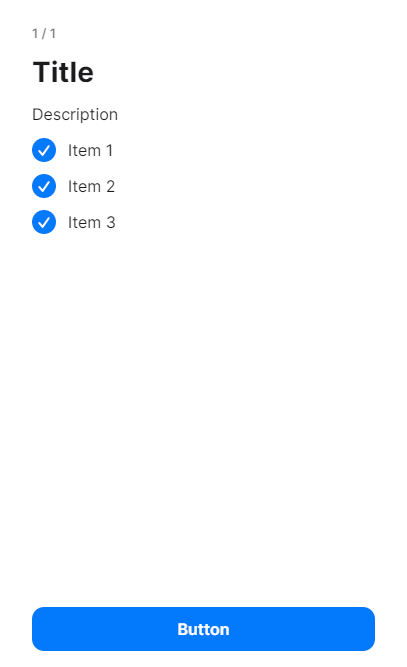

</details>

### TextAlign [Optional]

You can set the text alignment of your content using the `textAlign` parameter.

Available options: `'left' | 'right' | 'center'`
Default: `'left'`

> [!Note]
> This parameter won't affect list and forms

```ts
export default defineConfig({
  pages: [
    {
      extends: 'slide',
      title: 'Title',
      description: 'Description',
      textAlign: 'right',
      list: ['Item 1', 'Item 2', 'Item 3'],
      button: 'Button',
    },
  ],
});
```

<details>
  <summary>With the code above you will get this result:</summary>

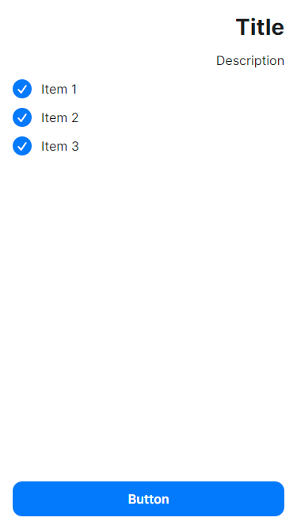

</details>

```ts
export default defineConfig({
  pages: [
    {
      slides: [
        {
          extends: 'slide',
          title: 'Title',
          description: 'Description',
          textAlign: 'center',
          pagination: 'count',
          list: ['Item 1', 'Item 2', 'Item 3'],
          button: 'Button',
        },
      ],
    },
  ],
});
```

<details>
  <summary>With the code above you will get this result:</summary>

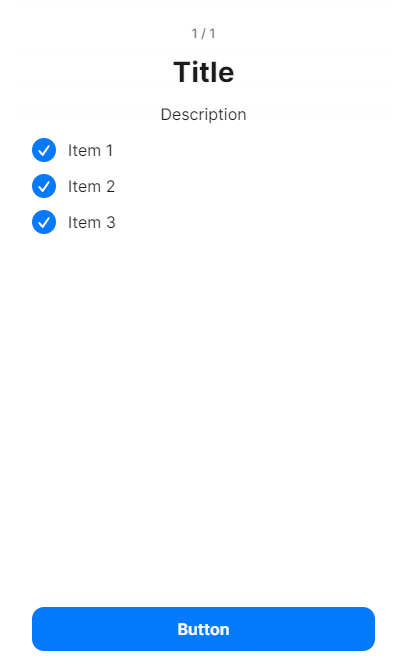

</details>

### Shape [Optional]

You can set shape of your content with help of `shape` parameter

Available parameters: `'rounded' | 'stacked' | 'square'`
default: `'square'`

```ts
export default defineConfig({
  pages: [
    {
      extends: 'slide',
      title: 'Title',
      media: {
        type: 'image',
        src: import('./assets/img/durov.webp'),
      },
      description: 'Description',
      list: ['Item 1', 'Item 2', 'Item 3'],
      button: 'Button',
    },
    {
      extends: 'slide',
      title: 'Title',
      media: {
        type: 'image',
        src: import('./assets/img/durov.webp'),
      },
      description: 'Description',
      shape: 'stacked',
      list: ['Item 1', 'Item 2', 'Item 3'],
      button: 'Button',
    },
    {
      extends: 'slide',
      title: 'Title',
      media: {
        type: 'image',
        src: import('./assets/img/durov.webp'),
      },
      shape: 'rounded',
      description: 'Description',
      list: ['Item 1', 'Item 2', 'Item 3'],
      button: 'Button',
    },
  ],
});
```

<details>
  <summary>With the code above you will get this result:</summary>

shape: 'square' (default)
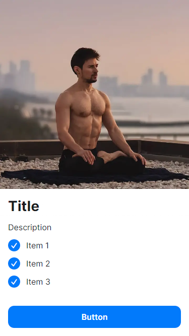

shape: 'stacked'
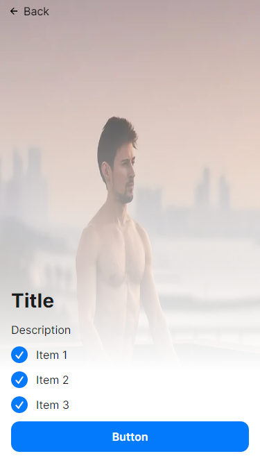

shape: 'rounded'


</details>

### Background [Optional]

You can set a custom background for the content on the slide if want.

This parameter will apply only to the content inside the slide, not the entire page

```ts
export default defineConfig({
  pages: [
    {
      extends: 'slide',
      title: 'Title',
      description: 'Description',
      background: '#00ff00',
      list: ['Item 1', 'Item 2', 'Item 3'],
      button: 'Button',
    },
  ],
});
```

<details>
  <summary>With the code above you will get this result:</summary>

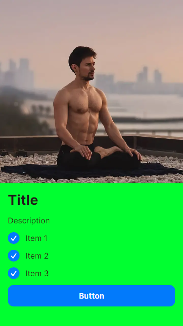

</details>

## form

```json
{
  "extends": "form"
}
```

[Link to the component](./packages/generation/presets/form/README.md)

This preset supports all parameters from the [slide](#slide) and introduces new ones: `form`.

### Parameters

#### Form

You can specify your form with this parameter.
Ensure that your IDs are unique

```ts
export default defineConfig({
  pages: [
    {
      extends: 'form',
      title: 'Title',
      description: 'Description',
      form: [
        {
          id: 'id1',
          type: 'text',
          placeholder: 'Text input',
        },
        {
          id: 'id2',
          type: 'number',
          placeholder: 'Number input',
        },
        {
          id: 'id3',
          type: 'checkbox',
          placeholder: 'Checkbox input',
        },
      ],
      button: 'Button',
    },
  ],
});
```

<details>
  <summary>With the code above you will get this result:</summary>

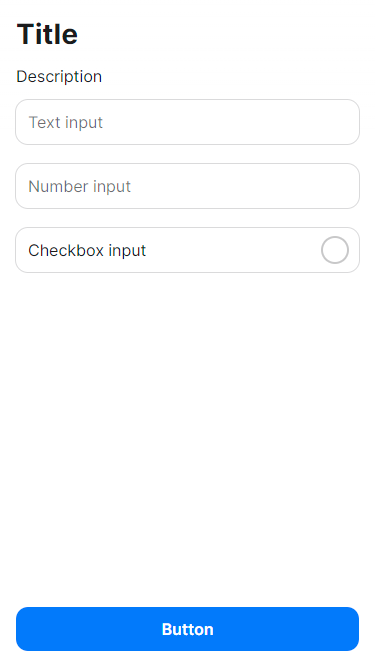

</details>

If you are familiar with other input types, you can also use them, such as type='date'.

All native input attributes are available.

```ts
export default defineConfig({
  pages: [
    {
      extends: 'form',
      title: 'Title',
      description: 'Description',
      form: [
        {
          id: 'id1',
          type: 'date',
          placeholder: 'Input date',
        },
      ],
      button: 'Button',
    },
  ],
});
```

<details>
  <summary>With the code above you will get this result:</summary>

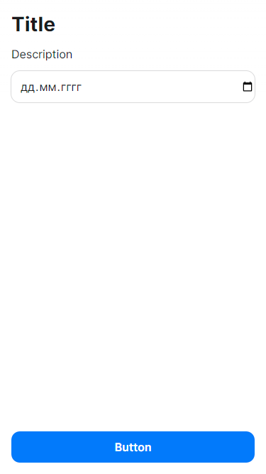

</details>

## paywall

```json
{
  "extends": "paywall"
}
```

[Link to the component](./packages/generation/presets/paywall/README.md)

The currency can be customized. [See these examples](#currency-config).

This preset supports all parameters except `button` from the [slide](#slide) and introduces new ones:

### Parameters

#### products [Required]

```ts
export default defineConfig({
  pages: [
    {
      extends: 'paywall',
      title: 'Title',
      description: 'Description',
      products: [
        {
          id: 'id1',
          title: 'Title',
          // You can display the price instead of the description using this "trick"
          description: '',
          price: 10,
        },
        {
          id: 'id2',
          title: 'Title 2',
          description: 'Description 2',
          price: 20,
          discount: 'Discount text',
        },
      ],
      links: [],
      mainButtonText: 'Button',
    },
  ],
});
```

<details>
  <summary>With the code above you will get this result:</summary>

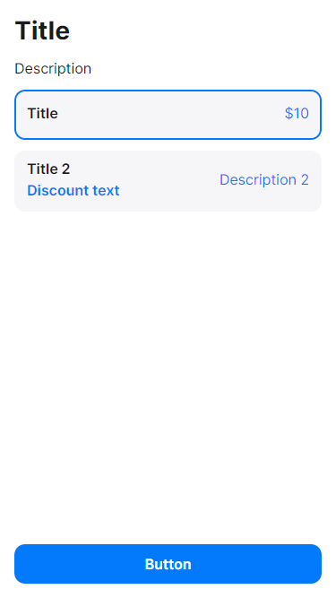

</details>

#### links [Required]

To display a link for terms of use and other necessary information for subscriptions or payments.

```ts
export default defineConfig({
  pages: [
    {
      extends: 'paywall',
      title: 'Title',
      description: 'Description',
      products: [
        ...
      ],
      links: [
        {
          text: 'Link 1',
          href: 'https://google.com'
        },
        {
          text: 'Link 2',
          href: 'https://google.com'
        }
      ],
      mainButtonText: 'Button',
    },
  ],
});
```

<details>
  <summary>With the code above you will get this result:</summary>


</details>

#### mainButtonText [Optional]

By default will be with "Continue" text

You can display the price inside the main button like this:

```ts
export default defineConfig({
  pages: [
    {
      extends: 'paywall',
      title: 'Title',
      description: 'Description',
      products: [
        ...
      ],
      links: [],
      mainButtonText: 'Subscribe for {price}',
    },
  ],
});
```

<details>
  <summary>With the code above you will get this result:</summary>

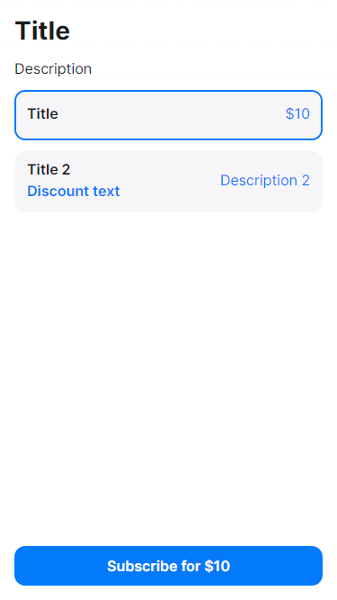

</details>

#### popup [Optional]

By default will be show our predefinned popup

##### type

By default: 'telegram'

You can specify this parameter to indicate your preference for displaying only web popups

```ts
export default defineConfig({
  pages: [
    {
      extends: 'paywall',
      title: 'Title',
      description: 'Description',
      products: [
        ...
      ],
      links: [],
      popup: {
        type: 'web'
      },
    },
  ],
});
```

<details>
  <summary>With the code above you will get this result:</summary>


</details>

##### title

By default: 'Choose the payment method'

```ts
export default defineConfig({
  pages: [
    {
      extends: 'paywall',
      title: 'Title',
      description: 'Description',
      products: [
        ...
      ],
      links: [],
      popup: {
        type: 'web',
        title: 'Are you happy?'
      },
    },
  ],
});
```

<details>
  <summary>With the code above you will get this result:</summary>

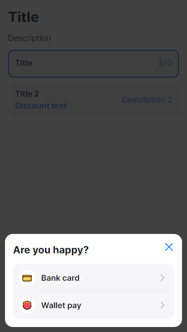

</details>

##### message

```ts
export default defineConfig({
  pages: [
    {
      extends: 'paywall',
      title: 'Title',
      description: 'Description',
      products: [
        ...
      ],
      links: [],
      popup: {
        type: 'web',
        title: 'Are you happy?',
        message: 'Tell me'
      },
    },
  ],
});
```

<details>
  <summary>With the code above you will get this result:</summary>

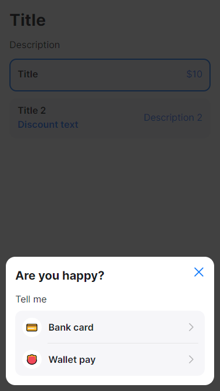

</details>

##### buttons

By default: ['telegram_payments', 'wallet_pay']

```ts
export default defineConfig({
  pages: [
    {
      extends: 'paywall',
      title: 'Title',
      description: 'Description',
      products: [
        ...
      ],
      links: [],
      popup: {
        type: 'web',
        title: 'Are you happy?',
        buttons: [
          {
            id: 'yes',
            text: 'Yes!',
            type: 'default'
          },
          {
            id: 'no',
            text: 'No!',
            type: 'destructive'
          }
        ]
      },
    },
  ],
});
```

<details>
  <summary>With the code above you will get this result:</summary>

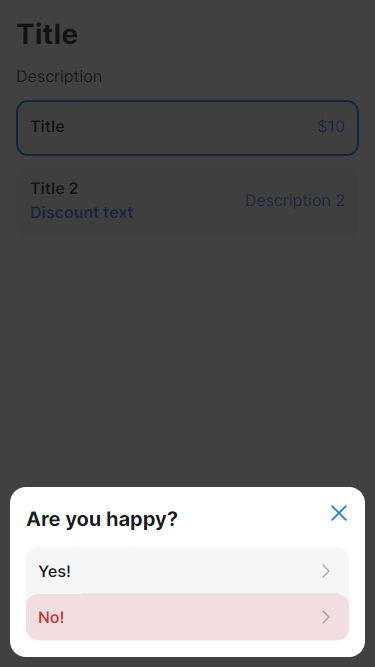

</details>

If the popup mode is `type='web'` you can specify the media parameter inside buttons:

All available parameters for [media see here](#media)

```ts
export default defineConfig({
  pages: [
    {
      extends: 'paywall',
      title: 'Title',
      description: 'Description',
      products: [
        ...
      ],
      links: [],
      popup: {
        type: 'web',
        title: 'Are you happy?',
        buttons: [
          {
            id: 'yes',
            text: 'Yes!',
            type: 'default',
            media: {
              type: 'emodji',
              src: '💳'
            }
          },
          {
            id: 'no',
            text: 'No!',
            type: 'destructive',
            media: {
              type: 'emodji',
              src: '💳'
            }
          }
        ]
      },
    },
  ],
});
```

<details>
  <summary>With the code above you will get this result:</summary>


</details>

## paywall_single

```json
{
  "extends": "paywall_single"
}
```

[Link to the component](./packages/generation/presets/paywall_single/README.md)

This preset supports all parameters (except `products`) from the [paywall](#paywall) and add new one:

### Parameters

#### product [Required]

```ts
export default defineConfig({
  pages: [
    {
      extends: 'paywall_single',
      title: 'Title',
      description: 'Description',
      product: {
        id: 'id',
        title: 'Product Title',
        price: 99,
        description: 'Product Description',
      },
      links: [],
    },
  ],
});
```

<details>
  <summary>With the code above you will get this result:</summary>

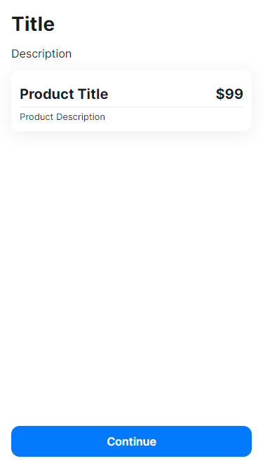

</details>

You can also include some [media](#media) for your product

```ts
export default defineConfig({
  pages: [
    {
      extends: 'paywall_single',
      title: 'Title',
      description: 'Description',
      product: {
        id: 'id',
        title: 'Product Title',
        media: {
          type: 'icon',
          src: import('./assets/icons/star.svg'),
          size: 40,
        },
        price: 99,
        description: 'Product Description',
      },
      links: [],
    },
  ],
});
```

<details>
  <summary>With the code above you will get this result:</summary>


</details>

## paywall_row

```json
{
  "extends": "paywall_row"
}
```

[Link to the component](./packages/generation/presets/paywall_row/README.md)

This preset supports all parameters from the [paywall](#paywall) but **overrides products**:

### Parameters

#### products [Required]

```ts
export default defineConfig({
  pages: [
    {
      extends: 'paywall_row',
      title: 'Title',
      description: 'Description',
      products: [
        {
          id: 'id1',
          price: 4.99,
          title: '4<br />credits',
          description: 'Perfect to<br />start with',
        },
        {
          id: 'id2',
          price: 8.99,
          title: '20<br />credits',
          description: 'Best value<br />offer',
          bestText: 'Best&nbsp;Choice',
        },
        {
          id: 'id3',
          price: 19.99,
          title: '100<br />credits',
          description: 'For true<br />enthusiasts',
        },
      ],
      links: [],
    },
  ],
});
```

<details>
  <summary>With the code above you will get this result:</summary>

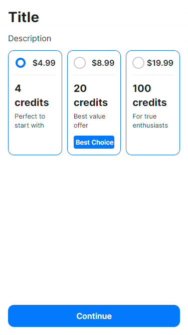

</details>

If you have a lot of products or only two, don't worry this component will take care of how to display them

```ts
export default defineConfig({
  pages: [
    {
      extends: 'paywall_row',
      title: 'Title',
      description: 'Description',
      products: [
        {
          id: 'id1',
          // ...
        },
        {
          id: 'id2',
          // ...
        },
        {
          id: 'id3',
          // ...
        },
        {
          id: 'id4',
          // ...
        },
        {
          id: 'id5',
          // ...
        },
        {
          id: 'id6',
          // ...
        },
      ],
      links: [],
    },
  ],
});
```

<details>
  <summary>With the code above you will get this result:</summary>

How it looks like
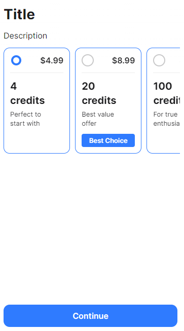

Expanded screenshot
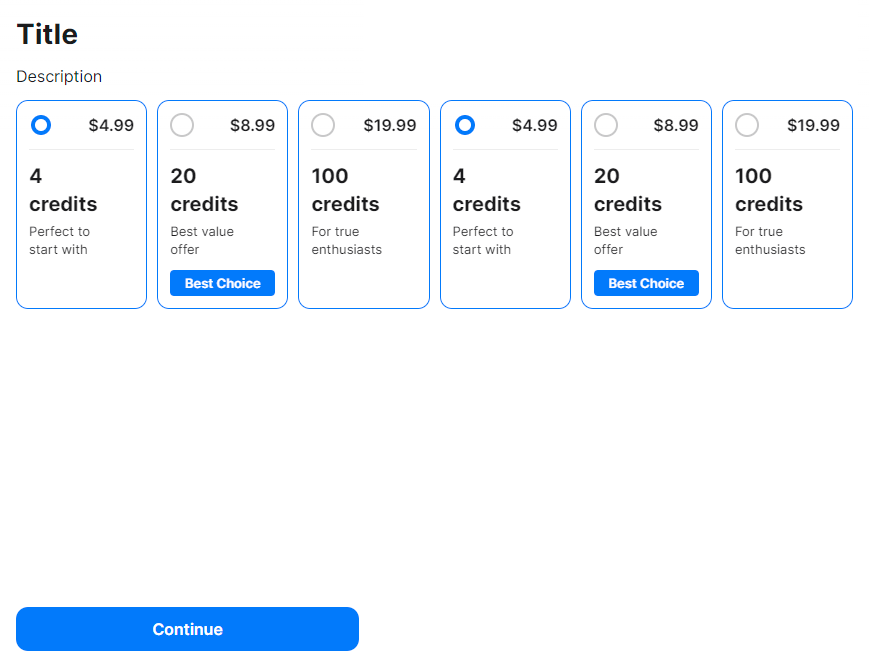

</details>

# Media

[Link to the component](./packages/generation/components/Media/README.md)

Media supports 5 types of content:

## Image

```ts
{
  media: {
    type: 'image',
    src: import('path/to/image.png'),
    // Optional.
    webp?: import('path/to/image.webp'),
    // Optional. If you aren't happy with our styles you can override them with this props
    style?: 'margin: ...; position: absolute; ...'
  }
}
```

Styles by default:

```css
.image {
  aspect-ratio: 1/1;
}
```

## Sticker

```ts
{
  media: {
    type: 'image',
    src: import('path/to/sticker.tgs'),
    // Optional.
    // size paramter of the sticker
    // if it's a number, like `size: 20` it will translate to:
    // {
    //  width: 20px;
    //  height: 20px;
    // }
    size?: number | [number, number],
    // if it's a [number, number], like `size: [20, 40]` it will translate to:
    // {
    //  width: 20px;
    //  height: 40px;
    // },
    // Optional
    style?: 'margin: ...; position: absolute; ...'
  }
}
```

Styles by default:

```css
.sticker {
  aspect-ratio: 1/1;
  max-height: 40vw;
}
```

## Video

```ts
{
  media: {
    type: 'video',
    src: import('path/to/video.mp4'),
    // Optional.
    // For a better user experience, you need to add this
    poster?: import('path/to/poster.png'),
    // Optional
    style?: 'margin: ...; position: absolute; ...'
  }
}
```

Styles by default:

```css
.video {
  aspect-ratio: 16/9;
}
```

## Icon

```ts
{
  media: {
    type: 'icon',
    src: import('path/to/icon.svg'),
    // Optional.
    size?: number | [number, number],
    // Optional
    style?: 'margin: ...; position: absolute; ...'
  }
}
```

Styles by default:

```css
.icon {
  width: 1.5em;
  height: 1.5em;
}
```

## Emodji

```ts
{
  media: {
    type: 'emodji',
    src: '💳',
    // Optional
    size?: number | [number, number],
    // Optional
    style?: 'margin: ...; position: absolute; ...'
  }
}
```

Styles by default:

```css
.emodji {
  width: 1.625em;
  height: 1.625em;
}
```

# Button Actions

You can specify button action behavior inside [slide.preset](#slide).
It will be shown as text with the default behavior of navigating to the next slide if possible.

> [!NOTE]
> You can't override button behavior for the [paywalls](#paywall)

```ts
export default defineConfig({
  pages: [
    {
      extends: 'slide',
      button: 'Text',
    },
  ],
});
```

Alternatively, you can navigate to a different page.
However, you need to specify the name of that page within your configuration.
Here's how you can do it:

```ts
export default defineConfig({
  pages: [
    {
      extends: 'slide',
      button: {
        content: 'Go to paywall',
        to: '/paywall', // this
      },
    },
    {
      extends: 'paywall',
      path: '/paywall', // and this will be connected
    },
  ],
});
```

> [!NOTE]
> If you need more actions, let us know, and we will easily add them

# Theme

You can specify what theme do you want to use inside your application

By default it will inherit Telegram.colorScheme

```ts
export default defineConfig({
  theme: 'light' | 'dark' | 'auto',
});
```

# Currency Config

You can specify what currency do you want to use inside your application

These are the parameters you can change and their default values:

```ts
const config = {
  // currency symbol alignment
  // default: 'left'
  align?: 'left' | 'right';

  // currency symbol
  // default: 'USD'
  currency?: CurrencyVariants;

  // separator for decimal 1.00 or 1,00 as you wish
  // default '.'
  decimalSeparator?: string;

  // separator for thousand 1_000_000 or 1x000x000
  // default '&nbsp;'
  thousandSeparator?: string;
}
```

It's support [localization](#currency-localization)

```ts
export default defineConfig({
  currencyConfig: {
    currency: 'AUD',
    align: 'right',
  },
});
```

# Localization

For localization you need to define `json` files with your tokens and localized values.
For example:

```json
// ru.json
{
  "_hello": "Привет!"
}

// en.json
{
  "_hello": "Hello!"
}
```

It's not necessary to use `_` at the beginning of each token; it's just for illustration purposes to make it easier to determine which value is being localized

```ts
export default defineConfig({
  locale: {
    fallback: 'en',
    ru: import('./locales/ru.json'),
    en: import('./locales/en.json'),
  },
  pages: [
    {
      extends: 'slide',
      // this will be automaticaly translated
      title: '_hello',
    },
  ],
});
```

> [!NOTE]
> Our i18n logic is extremely simple. You can use tokens like `slide1.product.title`.
> To correctly resolve the token value, your config should contain this:

```json
// locales/en.json
{
  "slide1": {
    "product": {
      "title": "Product Title"
    }
  }
}
```

> Do not try to trick it with values like:
> we haven't tested it yet :(

```json
// locales/en.json
{
  "slide1.product.title": "Product Title"
}
```

If your application supports the user's language, that language will be downloaded, and then the application will call the `Telegram.ready()` method to indicate that the app is ready for use.

If the user's language is not supported, the application will switch to the fallback language and download the locale for it.

If you haven't defined a locale, we will call the `Telegram.ready()` method right after the main page of the application is mounted.

# Currency localization

You can also use localization within the currency configuration:

```json
// ru.json
{
  "_currency": "RUB",
  "_price": 1000,
  "_align": "right",
  "_decimal": ",",
  "_thousands": "_"
}

// en.json
{
  "_currency": "USD",
  "_price": 10,
  "_align": "left",
  "_decimal": ".",
  "_thousands": " "
}
```

```ts
export default defineConfig({
  locale: {
    fallback: 'en',
    ru: import('./locales/ru.json'),
    en: import('./locales/en.json'),
  },
  currencyConfig: {
    currency: '_currency',
    align: '_align',
    decimalSeparator: '_decimal',
    thousandSeparator: '_thousands',
  },
  pages: [
    {
      extends: 'paywall',
      products: [
        {
          price: '_price',
          // ...
        },
      ],
      // ...
    },
  ],
});
```

# Custom Presets

> [!NOTE]
> Try to avoid using reserved preset names above.
> You can certainly do it to override ours, but you should understand what you're doing

[Example for this technique](./examples/ai/src/config.ts)

You can define custom presets if you want to using the following code:

```ts
// this will be inside intial bundle
import CustomPreset from './CustomPreset.vue';

// this will be loaded asynchronously when such preset will be shown
const AsyncCustomPreset = defineAsyncComponent(
  () => import('./CustomPreset.vue')
);

export default defineConfig({
  definePresets: {
    your_custom_name: CustomPreset,
    async_your_custom_name: AsyncCustomPreset,
  },
  // and use them as:
  pages: [
    {
      extends: 'your_custom_name',
      // extends: 'async_your_custom_name',
      // some props
    },
  ],
});
```
